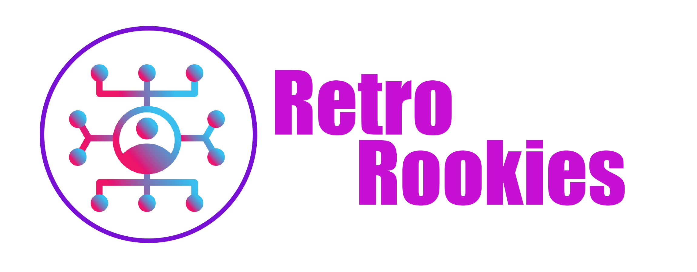
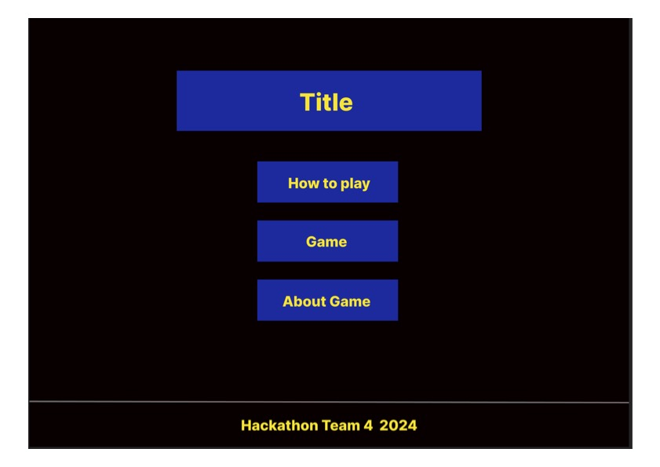
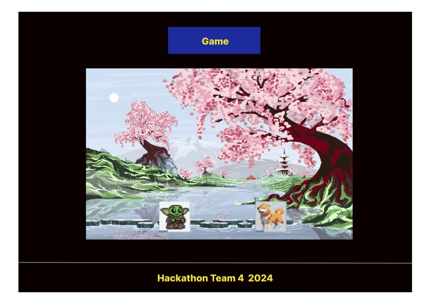
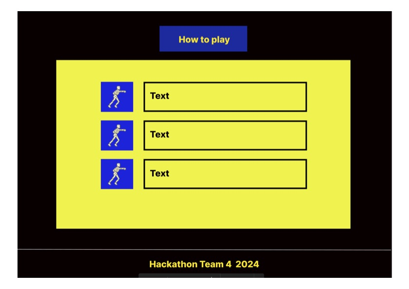
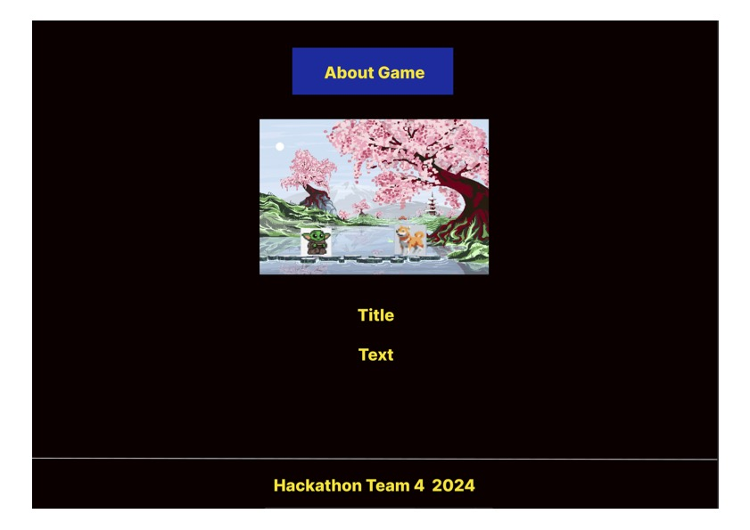

# Pixel Fighters: August 2024 Hackathon
 

Visit the deployed site: []
- - - 
## Overview
The project 'Pixel Fighters' is a one player 2D game built with HTML5, CSS, and JavaScript using pixel art inspired by 8bit style video games . The players character fights against the games character.  

## Project Structure
- `index.html`: The main entry point for the game.
- `css/`: Contains the stylesheet for the game.
- `js/`: Contains the JavaScript files, including the main game logic and utility functions.
- `assets/`: Directory for storing sprites and sound files.

## How to Run
Simply open `index.html` in a web browser to play the game.
## User Stories
### Navigation
- want to see the title of the game 'Pixel Fighters' as soon as I open the website with  access to the options; 'Start', How to Play' and 'About the Game'.
- want to see a large pixel logo against a plain background and a simple menu so I know the genre of the game
- want to hear 8-bit upbeat background music in line with the genre and to entice me to play the game.
- want the options to change colour when I hover with the cursor or browse with the keyboard so I can visually identify where I am navigating.
- want the option I select to change colour to signify I have selected it.
- want the option I select to make a sound effect to signify I have selected it.
- want sound effects as I browse between the options as an additional method to identify where I am navigating.
### Start
- want the 'start' button to be the first in the menu for speed and ease if I want to play immediately because I expect it to be intuitive.

### How to play
- want the option to learn the rules of the game and learn shortcuts to improve my performance when playing.

  ### Playing the game
- expect to be able to identify my character immediately so I am comfortable starting the game
- expect to be able to identify my opponent immediately so I am not confused who I am fighting against
- want to hear background music to keep me engaged and entertained
- want to hear sound effects to reflect movements of my character e.g jump and punch and sound effects as characters attack each other
- want to see a health bar so I can understand if I am winning or losing against my opponent
- want to see a 'win' or 'lose' at the end of a game to clarify who won or lost.   

### About the Game
- want to view the purpose for making the website so I can understand why it was created.
- want to view a list of individiuals involved in creating the project so I can understand who contributed and their role.  

## Criteria
- **Project is a retro game**
- **The project has 8 bit music and sound effects**
- **The project is fun to play**
- **The project inspires a strong feeling of nostalgia**
- **The project is presented to the judges in a fun and creative manner**

## Design

### Logo Design
- We have two logo designs, one for the game and one for our team:
  1. The game logo features pixel font and Marvel characters and will be displayed on every page.
    -  
  2. Our team logo includes an image of a network representing how we collaborate through GitHub as a team. Our team name is "Retro Rookies"
    -  

### Wireframes
- The wireframe is a preliminary design for the Throwback game pages. Please refer to the attached images below to view the wireframes:
* 
  

    
Home page

    
  

* 
  

    
Game page

    
  

* 
  

    
How to play page

    
  

* 
  

    
About page

    
  

### Colour scheme
### Font

- I used the Google font "Pixelify Sans" across all pages. You can find the font [Pixelify Sans](https://fonts.google.com/specimen/Pixelify+Sans?query=Pixel).

## Accessibility
- The CSS framework Bootstrap is used to provide a responsive experience across devices of various sizes.  

## Responsiveness

## Features

## Technology used
- HTML5
- CSS3
- Javascript
- [Phaser] (v3.80.1 "Nino")https://phaser.io/download/stable HTML5 Framework
- [Bootstrap](Version 5.0.2) (https://getbootstrap.com/docs/5.0/getting-started/introduction/) CSS Framework
- Adobe Photoshop to create design logo and charachers by Robert Quinlan 

  ## Credits
  ## Media
  ### Images:
   #### I used download images which used free licence as following below links:
  - [Vecteezy](https://www.vecteezy.com/vector-art/45562049-affiliate-marketing-icon-design) to create logo for our team called "Retro Rookies".
  - [Logo github](https://github.com/logos) to create logo on the footer pages which it includes link our team github's profile. 
  - Three image of marval charachers as follow links below:
    - [Blade characther](https://marvelsnapzone.com/variants/blade-01/)
    - [Wolverine characher](https://ie.pinterest.com/pin/33214115995401644/)
    - [Terminator characher](https://ie.pinterest.com/pin/671036413228810134/)
  

  ### Sound Effects:
  Background music and sound effects downloaded from [Pixabay](https://pixabay.com/)
  ## Team
  - Dimitri Edel [GitHub](https://github.com/dimitri-edel)
 
  - Maushum Gurrung [GitHub](https://github.com/grgmausham)
  
  - Jesse Lee Ross[GitHub](https://www.github.com/jesseross001)
  - Robert Quinlan[GitHub](https://github.com/RQISL)
  

